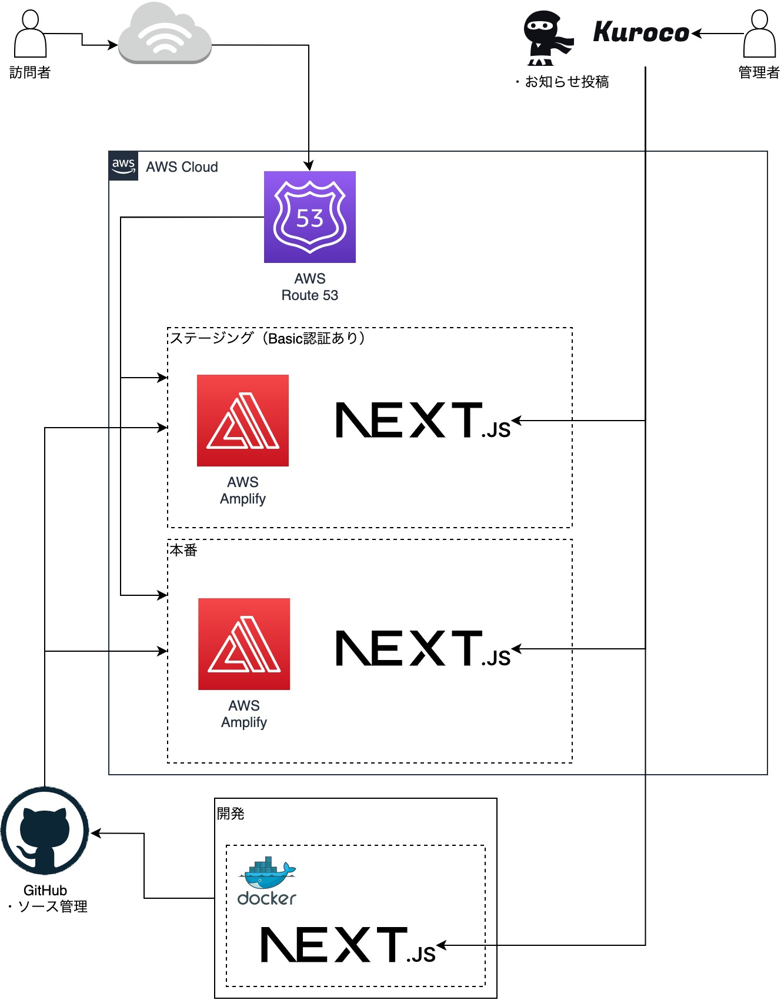

# After Works.

      

## Overview

This repository is my portfolio site.

- [Production Site](https://afterworks.jp/)
- [Project documentation on DeepWiki](https://deepwiki.com/InumberX/after_works-v006)

## Structure Diagram



## Development with Node.js

Start a shell such as PoworShell and navigate to the root of the project.

### Installing packages

Install the Node.js package.

```shell
npm install
```

### Execution of development tasks

Execute the following command.

```shell
npm run dev
```

The following URL will take you to the screen.

http://localhost:3000/

- Press "Ctrl + C" to stop

### Syntax Check

```shell
npm run lint
```

### Formatter

#### Check

```shell
npm run format
```

#### Check and Format

```shell
npm run format-fix
```

### Formatter (SCSS)

#### Check

```shell
npm run stylelint
```

#### Check and Format

```shell
npm run stylelint-fix
```

### Upgrading packages

#### Check

```shell
npm run upgrade-check
```

#### Upgrade

```shell
npm run upgrade
npm install
```

## Development with Docker

Start a shell such as PoworShell and navigate to the root of the project.

### Launching Containers

The container is started by executing the following command.

```shell
docker compose up -d
```

### Installing packages

Install the Node.js package.

```shell
docker compose exec frontend npm install
```

### Execution of development tasks

Execute the following command.

```shell
docker compose exec frontend npm run dev
```

The following URL will take you to the screen.

http://localhost:3000/

- Press "Ctrl + C" to stop

### Stopping Containers

Execute the following command to stop the container.

```shell
docker compose down
```

### Syntax Check

```shell
docker compose exec frontend npm run lint
```

### Formatter

#### Check

```shell
docker compose exec frontend npm run format
```

#### Check and Format

```shell
docker compose exec frontend npm run format-fix
```

### Formatter (SCSS)

#### Check

```shell
docker compose exec frontend npm run stylelint
```

#### Check and Format

```shell
docker compose exec frontend npm run stylelint-fix
```
